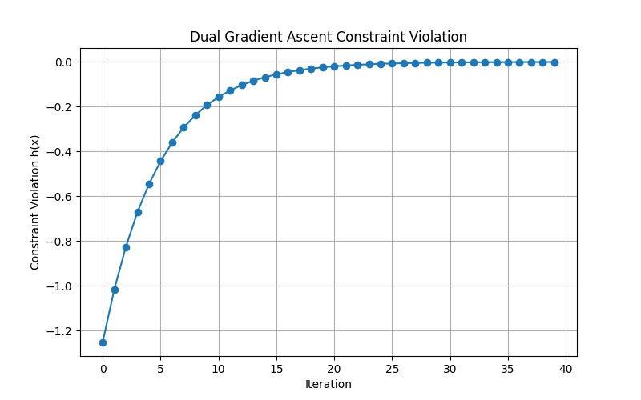

# Optimization & Machine Learning Portfolio


This repository hosts a comprehensive portfolio project demonstrating advanced mathematical optimization techniques and predictive modeling. It addresses two distinct computational challenges: **Non-Linear Regression Analysis** for demand forecasting and **Constrained Convex Optimization** for resource allocation.

## 👤 Author
**Aryan Malik** *Computer Science & Engineering*

---

## 📂 Repository Structure

The project is modularized into two independent solvers, each with its own source code, datasets, and output pipelines.

```text
Optimization-Portfolio/
│
├── RegressionAnalysis.pdf       # Detailed Analysis Report (Regression Module)
├── ConstrainedApplication.pdf   # Detailed Analysis Report (Optimization Module)
├── requirements.txt             # Project dependencies
├── README.md                    # Documentation
│
├── main_proj_code/              # [MODULE 1] Regression Analysis Source
│   ├── __init__.py
│   ├── model_definitions.py     # Architectures: Linear, Polynomial, Interaction
│   ├── preprocess.py            # Data cleaning & One-Hot Encoding pipeline
│   ├── train_and_evaluate.py    # Training & Cross-validation logic
│   ├── plot_results.py          # Visualization scripts (Scatter plots)
│   ├── run_all.py               # Main execution entry point
│   └── data/
│       └── train.xlsx           # Bike-sharing historical dataset
│
├── constrained_lagrangian_code/ # [MODULE 2] Constrained Optimization Source
│   ├── __init__.py
│   ├── problem_definition.py    # Cost functions & Linear Constraints
│   ├── lagrangian_relaxation.py # Analytical primal variable derivation
│   ├── dual_gradient_ascent.py  # Numerical iterative solver
│   ├── plots.py                 # Convergence visualization
│   └── run.py                   # Main execution entry point
│
└── results/                     # Generated Artifacts (Created upon execution)
    ├── best_model.txt           # Model Performance Metrics (MSE, R2)
    ├── metrics_table.xlsx       # Comparative Analysis
    ├── solution.txt             # Optimization Results (Lambda, Cost)
    ├── plots/                   # Prediction Visualizations
    └── dual_convergence.png     # Convergence Plot
```
## ⚙️ Setup & Installation
1. **Clone the repository:**
   ```bash
   git clone [https://github.com/AryanOg0209/Optimization-Project.git](https://github.com/AryanOg0209/Optimization-Project.git)
   cd Optimization-Project
   ```
2. **Install dependencies: Ensure you have Python 3.8+ installed. Then run:**
   ```bash
   pip install -r requirements.txt

## 🚀 Usage Instructions
1. **Running Module 1: Regression Analysis**
   ```bash
   cd main_proj_code
   python run_all.py
   ```
2. **Running Module 2: Constrained Optimization**
   ```bash
   cd constrained_lagrangian_code
   python run.py
## 📊 Results Snapshot
### 1. Regression Analysis Results
Comparison of the Baseline (Linear) vs. Best Model (Quadratic Interaction).

| Metric | Best Model (Quadratic Interaction) |
| :--- | :--- |
| **Test MSE** | **9755.92** |
| **Test R²** | **0.7044** |

### 2. Constrained Optimization Results
Convergence of the constraint violation using Dual Gradient Ascent. The error drops to zero (geometric decay).



## 📄 Documentation
### Click the links below to view the detailed PDF reports for each module. (Note: These files must be located in the root directory of the repository for the links to work.)

📘 Regression Analysis Report (PDF)

Detailed bias-variance analysis and model selection.

📘 Optimization Analysis Report (PDF)

Mathematical derivation of the dual function and convergence proofs.


